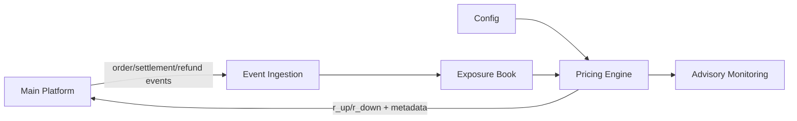

# risk

`risk` is a standalone risk quote vendor for Nicevent event contracts.

It calculates payout quotes (`r_up / r_down`) from:

- `platform_edge`
- current exposure
- asymmetric payout skew
- payout guardrails

It does not own money, order ledger, settlement, commission, or hard admission control. The main platform must keep L2/L3 admission limits, MaxLoss gates, settlement audit, and bankroll pause logic.

## Architecture



## Quote Contract

Every quote includes metadata that tells the main platform whether the quote is still trustworthy:

```json
{
  "quoteId": "risk-BTC-30s-1780000000000",
  "symbol": "BTC",
  "period": "30s",
  "rUp": 0.89,
  "rDown": 0.91,
  "platformEdge": 0.05,
  "houseEdge": 0.05,
  "generatedAt": 1780000000000,
  "expiresAt": 1780000000300,
  "exposureCursor": "event-seq-123456",
  "configVersion": "cfg-42",
  "modelVersion": "risk-payout-v1",
  "clampReason": null,
  "riskSignal": "normal"
}
```

Main platform rules:

- Use only quotes where `now <= expiresAt`.
- Reject stale quotes when `exposureCursor` is too far behind the platform's confirmed event cursor.
- Lock `payoutRateSnapshot` plus quote metadata on every accepted order.
- If the vendor is disconnected, quote is stale, event lag is too high, or config is invalid, pause new orders unless an explicit conservative fallback is configured.

## Event Contract

The main platform pushes events to `POST /events`.

Events must include:

- `eventId`: globally unique, used for idempotency.
- `sequence`: monotonically increasing cursor.
- `occurredAt`: business event time.
- `publishedAt`: event publish time.
- `type`: `ORDER_ACCEPTED`, `ORDER_PRICED`, `ORDER_SETTLED`, `ORDER_REFUNDED`, `ORDER_CANCELED`, or `ORDER_HELD`.
- `payload`: `orderId`, `symbol`, `period`, `direction`, `stake`, `payoutRateSnapshot`, `eventEndTime`, and status.

The vendor stores event state, ignores duplicate `eventId`, applies operations commutatively (so a late settle that arrives before its accept still converges), detects sequence gaps, and supports snapshot rebuild + event replay.

### Consistency & resync

- Events are persisted (when `DATABASE_URL` is set) **before** being applied; a storage failure returns `503` so the platform retries.
- The advertised `exposureCursor` is the **contiguous** sequence watermark; it never advances past a gap.
- When a gap is detected, `needsResync` becomes `true` and the vendor prices every product with a conservative `degraded` fallback quote until the gap is filled or a snapshot is pushed.
- On vendor startup (and after any gap), the main platform should rebuild the exposure mirror via `POST /v1/exposure/snapshot`:

```json
{ "snapshotCursor": "event-seq-123456", "positions": [ { "orderId": "...", "symbol": "BTC", "period": "30s", "direction": "LONG", "stake": 20, "eventEndTime": 1780000000000 } ] }
```

## Degraded & fallback quotes

When pricing cannot run safely, the vendor still publishes a quote so the platform can choose its own policy:

- `riskSignal: "degraded"` + `clampReason: "exposure_gap"` — exposure mirror has an open sequence gap.
- `riskSignal: "fallback"` + `clampReason: "pricing_error"` — pricing threw (e.g. bad config / negative edge).

Fallback quotes are symmetric at `publish_min_return_rate` (lowest payout / highest house edge). The main platform decides whether to honor them or pause new orders.

## Pricing Model

Base:

```text
gross = 1 - platform_edge
r_base = 1 - 2 * platform_edge
```

Exposure skew:

```text
imbalanceRatio = (LONG - SHORT) / max(LONG + SHORT, minExposureForSkew)
payoutSkew = clamp(imbalanceRatio * probability_skew_sensitivity, -probability_skew_max, probability_skew_max)
p_up = clamp(0.5 + payoutSkew, p_min, p_max)
p_down = 1 - p_up
r_up = gross / p_up - 1
r_down = gross / p_down - 1
```

Crowded LONG lowers `r_up`; crowded SHORT lowers `r_down`.

Final rates are clamped by:

- probability bounds
- `payout_rate_floor / payout_rate_ceiling`
- `publish_min_return_rate / publish_max_return_rate`
- per-second and per-order rate-change limits

Any quote with negative house edge is blocked.

## API

- `POST /events`: ingest platform events. _Auth: `RISK_EVENT_TOKEN`._
- `POST /v1/exposure/snapshot`: rebuild the exposure mirror from a snapshot. _Auth: `RISK_CONTROL_TOKEN`._
- `GET /v1/quotes?symbol=BTC&period=30s`: latest quote. _Auth: `RISK_QUOTE_TOKEN`._
- `GET /v1/exposure?symbol=BTC&period=30s`: current mirrored exposure. _Auth: `RISK_QUOTE_TOKEN`._
- `GET /v1/config`: current product configs. _Auth: `RISK_CONTROL_TOKEN`._
- `PUT /v1/config`: replace one product config. _Auth: `RISK_CONTROL_TOKEN`._
- `POST /v1/config/rollback`: roll back one product config to its previous version. _Auth: `RISK_CONTROL_TOKEN`._
- `GET /metrics`: advisory metrics. _Open._
- `GET /health`: health check (includes `needsResync`, `gapDepth`, `cursor`). _Open._

Auth uses `Authorization: Bearer <token>`. An empty token means the endpoint is open (local/dev only) — set all three tokens in production. Request bodies are capped at `MAX_BODY_BYTES` (default 1 MiB).

## Local Development

```bash
npm install
npm run check
npm test
npm run build
npm start
```

The service listens on `PORT` (default `8787`).

If `DATABASE_URL` is set, initialize Postgres first:

```bash
psql "$DATABASE_URL" -f db/schema.sql
```

## Ownership Boundary

`risk` owns:

- payout quote calculation
- quote metadata
- mirrored exposure
- advisory risk signals

Main platform owns:

- order admission
- MaxLoss gates
- wallet balance and freezes
- settlement and refunds
- bankroll pause
- final enforcement
